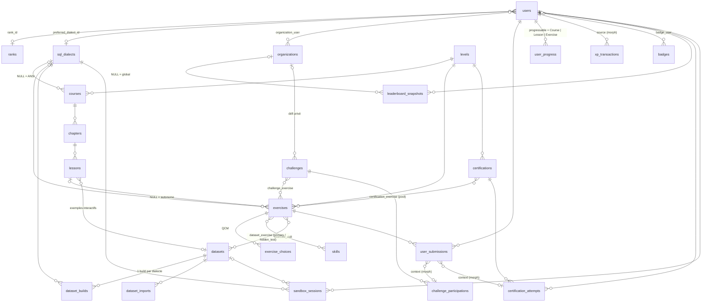

# 01 — Architecture de la base de données

> Base applicative (MySQL 8 / PostgreSQL en production, SQLite en tests).
> À ne pas confondre avec les **bases sandbox** dans lesquelles s'exécutent les requêtes des élèves
> (voir § 5) : elles sont physiquement séparées et accessibles via des comptes à privilèges réduits.

## 1. Vue d'ensemble par domaine

| Domaine | Tables |
|---|---|
| Identité & RBAC | `users` (+ colonnes `role`, `xp`, `rank_id`, streaks…), `organizations`, `organization_user` |
| Référentiels | `sql_dialects`, `levels`, `ranks`, `skills` |
| Contenu pédagogique | `courses` → `chapters` → `lessons` |
| Exercices | `exercises`, `exercise_choices`, `exercise_skill`, `dataset_exercise` |
| Jeux de données | `datasets`, `dataset_builds`, `dataset_imports` |
| Suivi | `user_submissions`, `user_progress` |
| Gamification | `xp_transactions`, `badges`, `badge_user`, `leaderboard_snapshots`, `challenges`, `challenge_exercise`, `challenge_participations` |
| Certification | `certifications`, `certification_exercise`, `certification_attempts` |
| Sandbox | `sandbox_sessions` |

Migrations : `database/migrations/2026_10_06_1000xx_*.php` — modèles : `app/Models` — enums : `app/Enums`.

## 2. Diagramme relationnel



## 3. Tables clés (détail)

### `users` (colonnes ajoutées à la table Jetstream)
| Colonne | Rôle |
|---|---|
| `role` | `admin` / `trainer` / `student` (`App\Enums\UserRole`). **Hors `$fillable`** : non assignable depuis un formulaire. |
| `xp` | Cache de `SUM(xp_transactions.amount)` — indexé pour le classement global. |
| `rank_id` | Rang courant, recalculé à chaque gain d'XP (`Rank::forXp()`). |
| `preferred_dialect_id` | Dialecte par défaut de l'éditeur. |
| `current_streak`, `longest_streak`, `last_activity_on` | Série de jours d'activité (badge « Régularité »). |
| `leaderboard_visible` | Opt-out RGPD des classements publics. |

### `exercises`
| Colonne | Rôle |
|---|---|
| `type` | `query_write`, `bug_fix`, `mcq`, `timed` |
| `sql_dialect_id` | `NULL` = SQL ANSI exécuté par défaut sur SQLite ; sinon exercice propre au dialecte (ex. `MERGE` T-SQL, bloc PL/SQL). |
| `starter_sql` | Squelette pré-rempli, ou **requête boguée** pour `bug_fix`. |
| `solution_sql` | Requête de référence. Masquée (`$hidden`) — ne quitte jamais le serveur. |
| `expected_result` | Snapshot `{columns, rows, hash}` pré-calculé par build : évite de réexécuter la solution à chaque soumission. |
| `validation_strategy` | `result_set` (ordre ignoré), `ordered_result_set` (pour `ORDER BY`), `state_check` (DML/DDL : on compare l'état des tables après exécution), `choices` (QCM). |
| `validation_options` | JSON : `allowed_statements`, `ignore_column_names`, `float_tolerance`, `case_sensitive`, `required_keywords` (ex. imposer une CTE)… |
| `hints` | `[{text, xp_penalty}]` — chaque indice consommé réduit l'XP gagné. |
| `max_execution_ms` | Timeout passé au moteur sandbox (`statement_timeout`, `max_execution_time`…). |

### `dataset_exercise` — validation anti-triche
Un exercice possède **un jeu `primary`** (visible, utilisé par le bouton « Exécuter ») et
**0..n jeux `hidden_test`** (mêmes tables, données différentes). « Valider » rejoue la requête
sur tous les jeux : une requête qui code le résultat en dur (`WHERE id IN (3, 7, 12)`) échoue.

### `datasets` / `dataset_builds` / `dataset_imports`
- `dataset_imports` trace chaque fichier déposé (SQL, CSV, JSON), traité **en file d'attente** (statut, lignes importées, erreurs).
- `datasets` est la forme canonique : métadonnées des tables (`tables_meta`), diagramme Mermaid généré automatiquement.
- `dataset_builds` contient le DDL + les données **traduits pour chaque dialecte** (types, quoting, auto-incréments…). C'est ce qui est rejoué pour provisionner une sandbox ; `seed_path` stocke les gros volumes sur disque.

### `user_submissions`
Toute exécution validée par l'élève (le simple « Exécuter » n'est pas historisé, pour garder la table légère).
`context_type/context_id` (morph) rattache la soumission à un défi ou à une tentative de certification.
`feedback` stocke le diff structuré (colonnes manquantes, lignes en trop/en moins) affiché par l'éditeur.

### `user_progress` (polymorphe)
Une ligne par (utilisateur, Course | Lesson | Exercise) — unique. Permet un tableau de bord rapide
(« 62 % du cours Jointures ») sans recalculer depuis les soumissions.

### `xp_transactions` — grand livre
Chaque gain/perte d'XP est une ligne immuable (`reason`, `source` morph). `users.xp` n'est qu'un cache.
Avantages : classements hebdomadaires/mensuels par simple `SUM … WHERE created_at >= ?`, audit et anti-triche
(rejouer, annuler un gain frauduleux).

### `leaderboard_snapshots`
Classements figés toutes les N minutes par une tâche planifiée (global + par organisation, par période).
L'affichage devient un simple `SELECT … ORDER BY position LIMIT 50`.

### `badges`
Règles déclaratives en JSON (`criteria`), évaluées par un service unique après chaque événement :
```json
{"type": "skill_exercises_solved", "skill": "joins", "count": 25}
{"type": "exercise_type_solved", "exercise_type": "bug_fix", "count": 15}
{"type": "daily_streak", "days": 7}
```
Ajouter un badge = une ligne en base, pas de déploiement.

### `certification_attempts`
`exercise_ids` fige le sujet tiré au sort au démarrage ; `expires_at` borne la durée ;
`certificate_code` (unique) permet une page publique de vérification du certificat.

### `sandbox_sessions`
Inventaire des bases éphémères (fichier SQLite, schéma PostgreSQL, base MySQL) avec `expires_at` :
une tâche planifiée détruit celles qui ont expiré.

## 4. Choix de conception

1. **Statuts en `string` + Enums PHP** plutôt que `ENUM` SQL : portable sur tous les moteurs,
   ajout d'une valeur sans migration `ALTER TABLE`, typage fort côté Eloquent (casts).
2. **`organizations` et non `groups`** : `GROUPS` est un mot réservé de MySQL 8.0.2+.
3. **Soft deletes** sur le contenu (cours, leçons, exercices, jeux, certifications) : l'historique
   des soumissions et des certificats reste cohérent.
4. **`restrictOnDelete` sur `levels`** : on ne supprime pas un niveau qui porte du contenu.
5. **Noms d'index explicites** quand l'auto-génération dépasserait 64 caractères (limite MySQL).
6. **Hiérarchie Cours → Chapitres → Leçons** : le chapitre porte le schéma relationnel illustratif
   (`schema_diagram`, Mermaid) demandé par le cahier des charges.
7. **Blocs de code interactifs** : écrits dans le Markdown de la leçon (```` ```sql runnable ````) et
   exécutés contre `lessons.dataset_id` — pas de table dédiée.

## 5. Sandbox d'exécution — principes retenus (détaillés à l'étape 3)

| Dialecte | Isolation | Statut initial |
|---|---|---|
| SQLite | Copie d'un fichier modèle par session, ouvert en lecture seule pour les exercices `SELECT` | ✅ activé (défaut) |
| PostgreSQL | Un **schéma** par sandbox, rôle sans privilèges, `SET statement_timeout`, transaction annulée (`ROLLBACK`) | ✅ activé |
| MySQL / MariaDB | Une **base** par sandbox, utilisateur limité à cette base, `max_execution_time` | ✅ MySQL / ⏳ MariaDB |
| SQL Server | Conteneur dédié, base par sandbox | ⏳ |
| Oracle | Oracle Database Free en conteneur + `yajra/laravel-oci8`, un schéma par sandbox | ⏳ |

Garde-fous communs : connexion **séparée** de la base applicative, utilisateur sans droits hors de sa
sandbox, timeout, limite de lignes retournées, liste blanche d'instructions par exercice, exécution
dans une transaction annulée pour les exercices DML.
