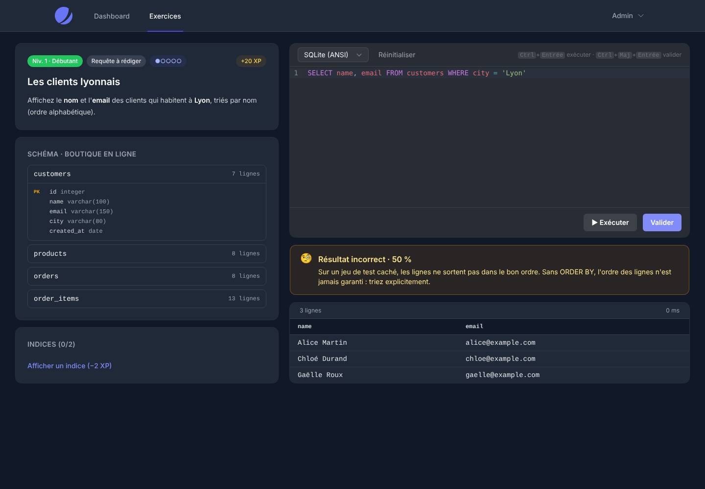

# 03 — Exécution sandbox et évaluation des requêtes



## 1. Parcours d'une requête

```text
ExercisePlayer (Livewire)                         app/Livewire/Exercises/ExercisePlayer.php
 ├─ run()    → SubmissionEvaluator::preview()      jeu visible uniquement, aucun enregistrement
 └─ submit() → SubmitAnswer::handle()              app/Actions/Exercises/SubmitAnswer.php
                ├─ SubmissionEvaluator::evaluate()
                │    pour chaque jeu de l'exercice (visible, puis tests cachés) :
                │      SandboxManager::run()        requête de l'élève
                │        ├─ QueryGuard::inspect()   refus avant exécution
                │        └─ Driver::execute()       SQLite, PostgreSQL ou MySQL, toujours annulé
                │      ExpectedResultResolver       solution de référence, mise en cache
                │      ResultSetComparator          diff colonnes / lignes, tolérance
                ├─ user_submissions + user_progress
                ├─ XpService::award()               xp_transactions → users.xp → rang
                ├─ StreakService::touch()
                └─ event(SubmissionEvaluated)       accroche pour badges et classements
```

## 2. Verdicts

| Situation | Statut | Score | Retour à l'élève |
|---|---|---|---|
| Correct sur tous les jeux | `correct` | 100 | + XP à la première réussite |
| Faux sur le jeu visible | `wrong` | 0 | Diff : colonnes attendues, lignes manquantes / en trop, ordre |
| Juste sur le jeu visible, faux sur un jeu caché | `wrong` | 50 | « Ne codez pas les valeurs en dur », ou « triez avec ORDER BY », sans dévoiler les données |
| Erreur SQL | `error` | 0 | Message du moteur, nettoyé |
| Refus du garde-fou | `rejected` | 0 | Raison (instruction interdite, mot-clé imposé...) |
| Délai dépassé | `timeout` | 0 | — |

**Stratégies** (`exercises.validation_strategy`) :
- `result_set` : l'ordre des lignes est ignoré ;
- `ordered_result_set` : l'ordre compte (exercices avec `ORDER BY`) ;
- `state_check` : pour les exercices DML ou DDL, on compare le résultat des `validation_options.check_queries` après exécution ;
- `choices` : QCM.

**Options** (`exercises.validation_options`) : `allowed_statements` (`select`, `dml`, `ddl`), `max_statements`,
`required_keywords`, `forbidden_keywords`, `float_tolerance` (absolue, par défaut 1e-6), `case_sensitive`,
`check_column_names`, `check_queries`.

**XP** : la récompense n'est donnée qu'à la première réussite. Chaque indice consulté retire son `xp_penalty`,
mais l'élève garde toujours au moins 20 % de la récompense. Les gains sont écrits dans `xp_transactions`.

## 3. Défense en profondeur

| Couche | SQLite | PostgreSQL | MySQL |
|---|---|---|---|
| Garde-fou applicatif (`QueryGuard`) | Liste blanche par exercice ; refus permanent d'`ATTACH`, `PRAGMA`, `VACUUM`, du contrôle de transaction, de `SET`, `COPY`, `DO`, `GRANT`, des fonctions de fichiers, de verrou, d'attente ou de SQL dynamique (`set_config`, `pg_read_file`, `query_to_xml`, `load_extension`, `SLEEP`, `BENCHMARK`, `GET_LOCK`…) | idem | idem, plus refus du DDL et de `TRUNCATE` (COMMIT implicite) |
| Scripts de jeux de données | Validés par `QueryGuard::inspectScript()` | idem | idem |
| Isolation d'exécution | Processus PHP séparé : `open_basedir` limité **au seul fichier de la base**, mémoire bornée, fonctions système désactivées, processus tué au-delà du délai | Compte `andromeda_runner` sans privilèges ; `statement_timeout` et `lock_timeout`, plus des plafonds au niveau du rôle ; `set_config` révoqué | Compte `andromeda_runner` limité à SELECT, INSERT, UPDATE et DELETE sur les bases `sbx_*` ; `max_execution_time` pour les SELECT ; `KILL QUERY` par une seconde connexion pour les modifications ; `innodb_lock_wait_timeout` |
| Persistance | Base modèle en lecture seule, ou copie jetable | `ROLLBACK` systématique | `ROLLBACK` systématique (DML uniquement) |
| Volume | Lecture ligne à ligne, arrêt à `max_rows` | Curseur `FETCH max_rows + 1` | Lecture non bufferisée, `KILL QUERY` à `max_rows` |
| Chargement des données | Dans le processus isolé | Compte `andromeda_owner`, sans privilèges serveur | Compte `andromeda_owner`, limité aux bases `sbx_*` |
| Débit | 30 exécutions par minute et par utilisateur | idem | idem |

Les tests `tests/Feature/Sandbox/*` vérifient ces protections : `ATTACH` vers un autre fichier, `COPY TO PROGRAM`,
`set_config`, `INTO OUTFILE`, timeouts (y compris pour une modification, interrompue par `KILL QUERY`), troncature,
ROLLBACK. Les tests PostgreSQL et MySQL sont ignorés si le serveur correspondant est absent.

## 4. Mise en place

```bash
# SQLite : rien à faire (bases modèles dans storage/app/private/sandbox/sqlite).

# PostgreSQL : serveur DÉDIÉ aux sandboxes, base vide.
createdb andromeda_sandbox
# .env : SANDBOX_PGSQL_* (hôte, base, mots de passe owner / runner)
php artisan sandbox:setup-pgsql --superuser=postgres   # demande le mot de passe du superutilisateur

# MySQL : serveur DÉDIÉ aux sandboxes.
# .env : SANDBOX_MYSQL_* (hôte, mots de passe owner / runner)
php artisan sandbox:setup-mysql --superuser=root
```

Contenu de démonstration (en local, via `php artisan migrate --seed`) : jeu « Boutique » plus un jeu de test caché,
5 exercices couvrant les 4 types et les 4 stratégies de validation.

## 5. Limites connues et suites

- **SQL Server et Oracle** : dialectes déclarés mais pas encore de moteur (`is_sandbox_enabled = false`).
  Il suffit d'ajouter une classe qui implémente `Contracts\SandboxDriver`. MariaDB pourra réutiliser `MysqlDriver`.
- **MySQL et DDL** : refusé, car le COMMIT implicite le rendrait impossible à annuler. Les exercices qui autorisent
  le DDL ne proposent donc pas MySQL (`SandboxDriver::supportsDdl()`). Pour l'ouvrir, il faudrait une base jetable
  par exécution.
- **MySQL et collation** : `utf8mb4` par défaut, insensible à la casse et aux accents (`'lyon' = 'Lyon'`).
  C'est le comportement réel de MySQL, qui diffère de PostgreSQL et SQLite.
- **PostgreSQL et DDL** : l'élève peut créer des objets, mais pas modifier ni supprimer les tables existantes,
  qui appartiennent au compte propriétaire. À revoir pour les exercices de niveau 4.
- **PostgreSQL et séquences** : les séquences avancent même après `ROLLBACK`. Les `check_queries` ne doivent donc pas
  comparer des identifiants générés.
- **Procédural (niveau 4)** : `CREATE FUNCTION`, `DO` et les triggers PL/pgSQL sont bloqués pour l'instant.
  Les ouvrir demandera de tuer côté serveur les requêtes qui dépassent le délai (`pg_terminate_backend`).
- **Serveur PostgreSQL** : par défaut, le rôle `PUBLIC` peut se connecter aux autres bases du serveur, d'où
  l'exigence d'un serveur dédié aux sandboxes.
